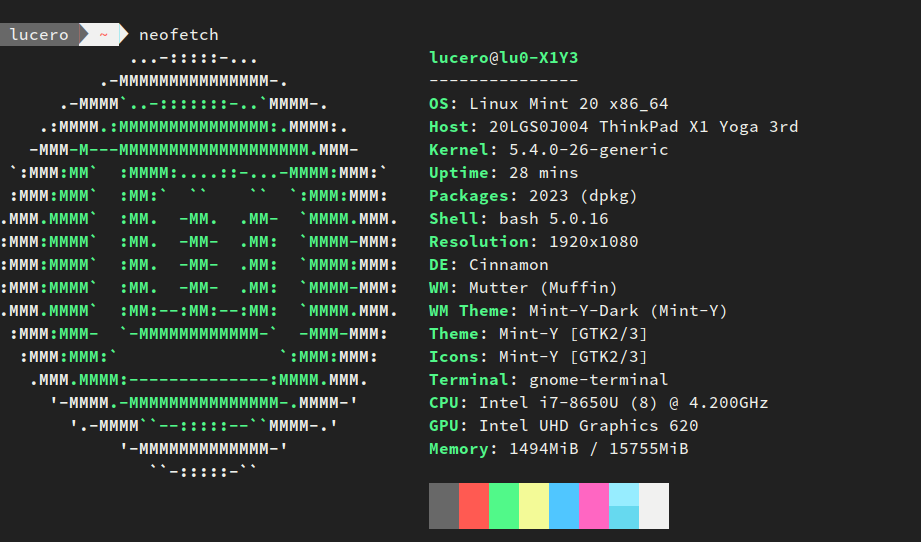
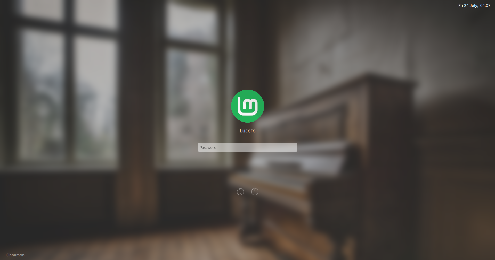
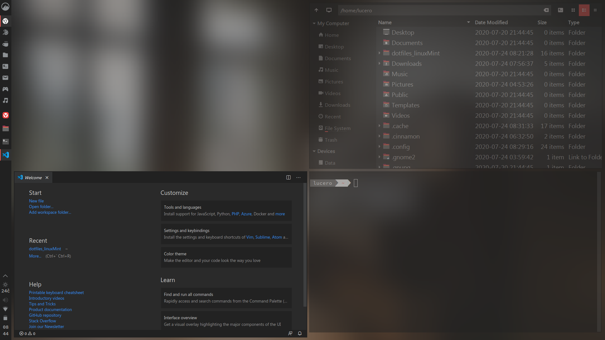

# Dotfiles for Linux Mint
My Linux Mint (cinnamon) post-installation setup.

## Clone repo
```zsh
# Clone with submodules
git clone --recursive https://github.com/lu0/dotfiles_linuxMint ~/.dotfiles_linuxMint
cd ~/.dotfiles_linuxMint
```

## Install DCONF
I use it to edit system settings.
``` zsh
sudo apt-get install dconf-editor -y    # System configuration tool
```

## Keybindings
Load keybindings I use.
```zsh
# Cinnamon
dconf load / < ~/.dotfiles_linuxMint/dconf-files/desktop-keybindings.conf
```

## Terminal
Bash theme and profile.


```zsh
# Theme and fonts
sudo cp -r fonts/source-code-pro/OTF /usr/share/fonts/opentype/source-code-pro
mkdir ~/.myscripts && ln -srf bash/fancy-bash.sh ~/.myscripts/

# Profiles and settings
dconf load /org/gnome/terminal/ < dconf-files/gnome-terminal.conf

# Aliases and profile
ln -srf bash/bashrc ~/.bashrc
ln -srf bash/profile ~/.profile

# Script to create new Github repo and push from current directory
ln -srf scripts/git-create-repo.sh ~/.myscripts/github

sudo ln -srf bash/inputrc /etc/inputrc
```
Restart the terminal.

## Display manager
Use SDDM (plasma-like login-screen) instead of lightDM (default).

```zsh
# Install SDDM, theme and dependencies
./scripts/install-sddm.sh

# Background and user images
sudo ln -srf cinnamon/wallpaper.jpg /usr/share/backgrounds/wallpaper.jpg
sudo ln -srf cinnamon/mintLogo_alt.png ~/.face.icon
```
Reboot to apply.


## Custom Cinnamon Appearance
Themes and tweaks I use for the Cinnamon DE. Reboot after configuration.



### Disable shadows in window borders
```zsh
sudo ln -srf config/environment /etc/environment
```
You might need to logout and login to session after this.

### Set transparency for unfocused windows
```zsh
# Install dependencies
sudo apt-get install xdotool wmctrl -y

# Link script to a directory in HOME
mkdir -p ~/.myscripts
ln -srf cinnamon/opacify_windows.sh ~/.myscripts/opacify-windows.sh

# Create startup entry
mkdir -p ~/.config/autostart
ln -srf config/autostart/opacify_windows.desktop ~/.config/autostart/
```
Restart the user's session.

### Icons and Themes
```zsh
# Papirus icons
 ./cinnamon/appearance/icons/install-papirus.sh 
 papirus-folders --color yaru --theme Papirus-Dark
 
# Custom theme
cd cinnamon/appearance/
sudo unzip themes/Minimal_RedAccents/Minimal_RedAccents.zip -d /usr/share/themes
sudo ln -srf themes/Minimal_RedAccents/cinnamon.css /usr/share/themes/Minimal_RedAccents/cinnamon/cinnamon.css
sudo ln -srf themes/Minimal_RedAccents/gtk.css /usr/share/themes/Minimal_RedAccents/gtk-3.0/gtk.css
sudo ln -srf themes/Minimal_RedAccents/metacity-theme-3.xml /usr/share/themes/Minimal_RedAccents/metacity-1/metacity-theme-3.xml
cd ../../

# Fonts
sudo cp -r fonts/source-code-pro/OTF /usr/share/fonts/opentype/source-code-pro
sudo cp -r fonts/karla /usr/share/fonts/opentype/karla
sudo cp -r fonts/webly-sleek /usr/share/fonts/truetype/webly-sleek-ui

# Apply changes
dconf load / < dconf-files/cinnamon-theme.conf

# Sound theme
sudo apt-get install sox -y
dconf load /org/cinnamon/ < dconf-files/system-sounds.conf    # sound theme
```

### Blur wallpaper when desktop is "busy"
```zsh
# Wallpaper I use
sudo ln -srf cinnamon/wallpaper.jpg /usr/share/backgrounds/wallpaper.jpg
sudo ln -srf cinnamon/wallpaper-blur.png /usr/share/backgrounds/wallpaper-blur.png

# Dependencies and wallpaper
sudo apt-get install wmctrl graphicsmagick feh -y   # blur wallpaper when busy
feh --bg-fill "/usr/share/backgrounds/wallpaper.jpg"

# Link script to a directory in HOME
mkdir -p ~/.myscripts
ln -srf cinnamon/feh-blur-wallpaper/feh-blur ~/.myscripts/feh-blur.sh

# Create startup entry
mkdir -p ~/.config/autostart
ln -srf config/autostart/blur-wallpaper.desktop ~/.config/autostart/
```

### Devilspie
Control newly opened windows, modify ```config/devilspie2/config-dp.lua``` to suit your needs, I use it to:
- Maximize windows
- Open applications to specific workspaces
- Set default geometry of some windows
```zsh
# Install devilspie
sudo apt-get install devilspie2 -y

# Link configuration 
ln -srf config/devilspie2 ~/.config/devilspie2

# Create startup entry
mkdir -p ~/.config/autostart
ln -srf config/autostart/Devilspie.desktop ~/.config/autostart/
```

### Custom Spices
I use some applets I modified to fit into vertical panels.
```zsh
# Install applets and extensions
./cinnamon/install-spices.sh

# Left panel with the applets and workspaces I use
dconf load / < dconf-files/panel.conf
```

### Custom Powermenu

Run custom powermenu with ```Super``` + ```Home```.
```zsh
# Install dependencies
sudo apt-get install rofi scrot imagemagick -y

# Create and copy neccesary files and links
mkdir -p ~/.config/rofi
ln -srf rofi-blurry-powermenu/powermenu.sh ~/.config/rofi
ln -srf rofi-blurry-powermenu/powermenu_theme.rasi ~/.config/rofi
sudo cp -r rofi-blurry-powermenu/fonts/* /usr/share/fonts/
```

## Install programs
Programs, apps and packages I use:
* Graphics
  - Krita
  - Inkscape
  - Gimp
* Games
  - Play On Linux
  - Steam
* Internet
  - Vivaldi Browser (with setup)
  - Team Viewer
* Office Suite
  - OnlyOffice
* Coding
  - VS Code (with setup)
  - NeoVim
* Sound & Video
  - Audacity
  - Sound converter
  - Spotify
  - Cheese (webcam)
  - KDEnLive (video editor)
* Administration
  - GParted
  - System profiler
  - Bluetooth Manager
  
```zsh
cd scripts
source install-programs.sh

# Enable custom startup apps
ln -srf startup_session.sh ~/.myscripts/
cd ../

# Create startup entry
mkdir -p ~/.config/autostart
ln -srf config/autostart/mystartup-apps.desktop ~/.config/autostart/

# Disable some default startup apps
ln -srf $HOME/.dotfiles_linuxMint/config/autostart/* $HOME/.config/autostart/
```

### Additional settings
Additional settings for some programs.
* Gnome screenshot: auto-save folder on ```~/Pictures/Screenshots```
* Cheese (webcam): Change default resolution to 720p
* Hide bluetooth (blueberry) from panel
* Disable sleep/hibernation
* Touchpad with edge scrolling 
* Lock touchscreen orientation
* Nemo
  - Keybindings
  - Compact view
  - Hide desktop icons
  - Print from context menu
```zsh
dconf load / < dconf-files/miscellaneous.conf

# Nemo file manager
mkdir -p ~/.gnome2/accels/
ln -srf config/nemo-keybindings ~/.gnome2/accels/nemo
dconf load / < dconf-files/nemo-fileman.conf
ln -srf scripts/nemo/print ~/.local/share/nemo/scripts/
pkill nemo
```

## Additional setup for Thinkpad X1Y3

### Vim and media keys
I use ```AltGr``` + ```H```,```J```,```K```,```L``` as arrow keys and ```U```,```I``` as Prior and Next keys; ```CapsLock``` is mapped to ```Escape``` and ```Shift```+```CapsLock``` to ```CapsLock```. Additionally, the Thinkpad X1Y3 does not have media keys, so I map ```Prior```, ```Next``` and ```↑``` to Previous track, Next track and Play/Pause.
```zsh 
# Dependencies
sudo apt-get install xcape -y

# Config file
ln -srf scripts/customkeys-config.lst ~/.myscripts/.customkeys-config.lst

# Link script to a directory in HOME
mkdir -p ~/.myscripts
ln -srf scripts/apply-keymappings.sh ~/.myscripts/

# Create startup entry
mkdir -p ~/.config/autostart
ln -srf config/autostart/keymappings.desktop ~/.config/autostart/
```

### Battery Managment
Change battery thresholds.
```zsh
# Install TLP managment and dependencies
sudo add-apt-repository ppa:linrunner/tlp
sudo apt update
sudo apt install tlp tlp-rdw -y
sudo apt-get install acpi-call-dkms -y

# I keep charge between 50%-60%
sudo tlp start
sudo ln -srf config/tlp-battery.conf /etc/tlp.conf
sudo tlp start

# Check status
battery         # If using the custom bash profile.
```

### Undervolting
[Undervolt](https://github.com/georgewhewell/undervolt) Intel CPU to decrease CPU temperatures.
```zsh
# Install dependencies
sudo apt-get install python3-pip
sudo pip3 install undervolt

# I Undervolt by 120mV
sudo undervolt --core -100 --cache -10

# Or set a temperature target of 70°C
sudo undervolt --temp 70
```
Run at startup
```zsh
sudo ln -srf config/undervolt.service /etc/systemd/system/
```
Check if script works, then enable it:
```zsh
systemctl start undervolt
systemctl enable undervolt
```